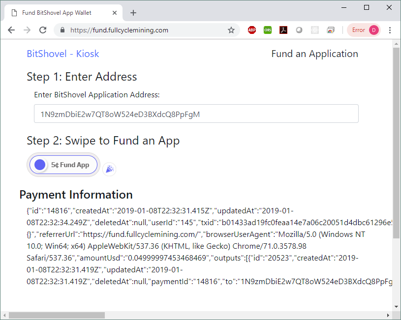

# Getting Started with BitShovel
BitShovel is a tool that makes it easy to write bitcoin applications. 

Take a few minutes to [understand it](/README.md) if you don't know what it is.

In this tutorial you will learn how to install BitShovel and use it to read and write to bitcoin using a few simple commands.

# Dependencies
You should have Docker installed as well as redis-cli (currently required for command line testing and demonstration)

### Step 1: Install BitShovel
First you need a local message bus. Redis is nice and simple. Run it if you don't have it already. This may require sudo.
```
docker run -p 6379:6379 redis
```
Now for the hard part. Installing BitShovel!
```
docker run --network=host dfoderick/bitshovel:getstarted
```
BitShovel will download and start. You should see it respond with `Connected to local bus...`  
Hmmm. That was too easy. BitShovel is now installed and running. 
### Step 2: Download the Memo.cash component
The base implementation of BitShovel will read and write to bitcoin but it doesn't know about any application specific protocols like memo.cash. Open another terminal and run the following command to download and run a component that understands memo.cash messages.
```
docker run --network=host dfoderick/bitshovel-memo:getstarted
```
That's it! Now your shovel will know how to post to the memo.cash web site using bitcoin. In the near future there will be additional components that you can download just as easily to add functionality to your apps. And you can write your own custom components in any language.
### Step 3: Testing your installation and Funding your wallet
Before we send messages to bitcoin, let's make life a bit easier on ourselves. Open yet another terminal and run the following commands (or put them in your Bash ~/.bashrc script).
```
alias sub="redis-cli subscribe"
alias pub="redis-cli publish"
alias get="redis-cli get"
```
BitShovel created a wallet when it started for the first time. To get the address for your wallet run
```
get bitshovel.wallet.address
```
Your wallet will need money so that it can send messages to bitcoin. There are at least 3 ways to get it funded.

* The simplest way to fund your wallet is go to https://fund.fullcyclemining.com/
Enter the address from above. Select an amount (0.05 cents is plenty for testing) then slide the money button. Your payment information will show below when it is successful.


* If that doesn't work then fund the wallet using MoneyButton's test page. https://www.moneybutton.com/test   

 * Alternatively, if you already have a wallet that is funded and you know the private key then you can tell BitShovel to use it instead.
```
pub bitshovel.wallet <your_very_private_key_wif>
get bitshovel.wallet.address
```
Remember your address. You will listen to messages going to this address in the next step.
### Step 4: Listen for bitcoin messages
At this point BitShovel is not doing anything. Lets tell it to listen for bitcoin messages on the local message bus.
```
sub bitshovel.watch
```
Not so interesting. It subscribes to the watch event and then just sits there. The terminal is waiting for bitcoin messages but there are not any messages locally yet. Leave that terminal window open and visible.
Open another terminal window and run the following commands to get the last 3 messages from bitcoin.
(Remember to run the alias commands if you did not put them in your startup script.)
```
alias pub="redis-cli publish"
pub bitshovel.query '{"find":{},"limit":3}'
```
Better. Three bitcoin messages should scroll in the watch window. You are now streaming messages from bitcoin on to our local message bus. Next tell BitShovel to listen for messages that you will be sending in the next step.
```
pub bitshovel.app 'start walletname PasteYourWalletAddressFromAbove'
```
Again, this command does not display anthing. It tells BitShovel to sit and wait for someone to send something to your wallet address. That someone will be you in the next step. Let's move on...
### Step 5: Sending messages to bitcoin
Finally, we can send a message to bitcoin! This command will create a transaction that contains an OP_RETURN.
```
pub bitshovel.send '"Hello from BitShovel!"'
```
The watch window that you set up in the previous step should show the transaction in a few seconds. Our UI is not so lovely at this point but we can console ourselves because we know there are many UI tools already that make for a great experience using bitcoin. Lets use some of them now. Search for the message you just sent using searchbsv.com.  
https://searchbsv.com/search?q=BitShovel

It's there. Great! Next, we can make use of the Memo plugin.
```
pub memo.send "Test from BitShovel Memo"
```
Notice the difference? You used memo.send instead of bitshovel.send. The difference is that you sent it to the memo component - the memo component transformed the message according to the Memo protocol and then it forwarded your message to BitShovel which broadcast the message to bitcoin. Yeah!

Log in to https://sv.memo.cash and find your message. Notice that your user name is just your address. Let's change that.
```
pub memo.send 'setname "BitShovel"'
```
That's better. Now publish a message with a topic. "BitShovel" is the topic and "Test Topic" is the message.
```
pub memo.send 'posttopic "BitShovel" "Test Topic"'
```
Refresh the Memo page to see the results.
# Conclusion
Pause for a moment and consider what you have learned in this tutorial. You have seen that with just a simple download and few commands you can read and write to bitcoin.
* You can get notified whenever someone sends a message or payment to your wallet address.
* You can do something intereting whenever that notification happens. 
* You can then send a message back to bitcoin in response.

BitShovel makes it easy.
